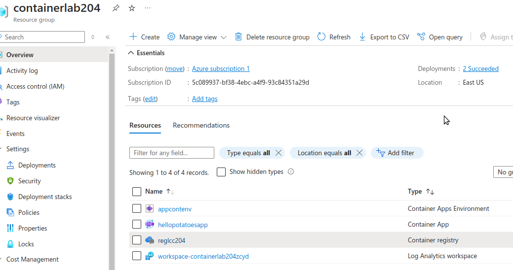
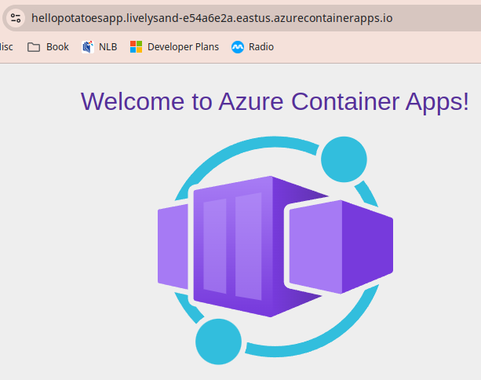
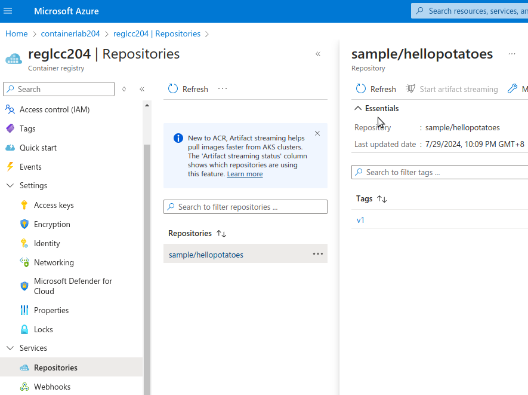
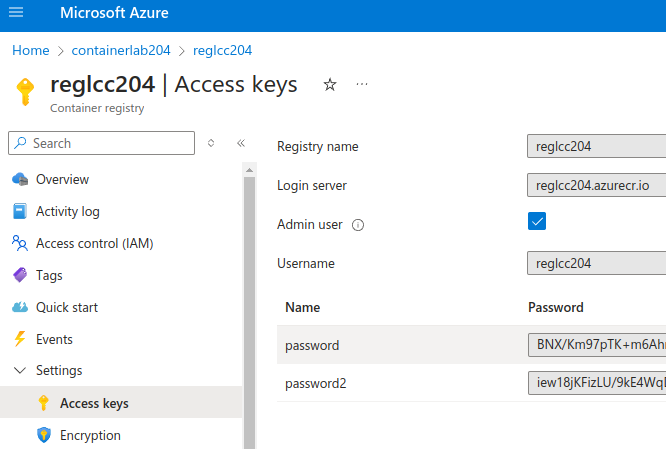

# Steps

# Create container environment and container apps

The resources created:



[Exercise - Deploy a container app ](https://learn.microsoft.com/en-us/training/modules/implement-azure-container-apps/3-exercise-deploy-app):
1. Create Container Apps Environment
2. Create Container Apps with images




# Create container repository

Container repository created from the steps below:



**Admin account** in the container registry need to be enable. The **admin account** is disabled by default.



```
# copy the line FROM xxx to Dockerfile.

# To create the container registry resource
az acr create --resource-group containerlab204 --name reglcc204 --sku Basic

# To build and push the image
az acr build --image sample/hellopotatoes:v1 --registry reglcc204 --file Dockerfile .

# The output is at the end of this file.

# To list the repositories in the registry
az acr repository list --name reglcc204 --output table

# Output:
Result
--------------------
sample/hellopotatoes

# To list the tags of the image
az acr repository show-tags --name reglcc204 \
    --repository sample/hellopotatoes --output table

# Output
Result
--------
v1

# Run the container
# The cmd parameter in this example runs the container in its default configuration

az acr run --registry reglcc204 \
    --cmd '$Registry/sample/hellopotatoes:v1' /dev/null

# Output

Queued a run with ID: ca2
Waiting for an agent...
2024/07/29 14:24:52 Alias support enabled for version >= 1.1.0, please see https://aka.ms/acr/tasks/task-aliases for more information.
2024/07/29 14:24:52 Creating Docker network: acb_default_network, driver: 'bridge'
2024/07/29 14:24:52 Successfully set up Docker network: acb_default_network
2024/07/29 14:24:52 Setting up Docker configuration...
2024/07/29 14:24:52 Successfully set up Docker configuration
2024/07/29 14:24:52 Logging in to registry: reglcc204.azurecr.io
2024/07/29 14:24:53 Successfully logged into reglcc204.azurecr.io
2024/07/29 14:24:53 Executing step ID: acb_step_0. Timeout(sec): 600, Working directory: '', Network: 'acb_default_network'
2024/07/29 14:24:53 Launching container with name: acb_step_0
Unable to find image 'reglcc204.azurecr.io/sample/hellopotatoes:v1' locally
v1: Pulling from sample/hellopotatoes
1b930d010525: Pulling fs layer
1b930d010525: Verifying Checksum
1b930d010525: Download complete
1b930d010525: Pull complete
Digest: sha256:92c7f9c92844bbbb5d0a101b22f7c2a7949e40f8ea90c8b3bc396879d95e899a
Status: Downloaded newer image for reglcc204.azurecr.io/sample/hellopotatoes:v1

Hello from Docker!
This message shows that your installation appears to be working correctly.

To generate this message, Docker took the following steps:
 1. The Docker client contacted the Docker daemon.
 2. The Docker daemon pulled the "hello-world" image from the Docker Hub.
    (amd64)
 3. The Docker daemon created a new container from that image which runs the
    executable that produces the output you are currently reading.
 4. The Docker daemon streamed that output to the Docker client, which sent it
    to your terminal.

To try something more ambitious, you can run an Ubuntu container with:
 $ docker run -it ubuntu bash

Share images, automate workflows, and more with a free Docker ID:
 https://hub.docker.com/

For more examples and ideas, visit:
 https://docs.docker.com/get-started/

2024/07/29 14:24:54 Successfully executed container: acb_step_0
2024/07/29 14:24:54 Step ID: acb_step_0 marked as successful (elapsed time in seconds: 0.927855)

Run ID: ca2 was successful after 3s

# Clean up resources

az group delete --name containerlab204 --no-wait
```

Output from the **acr build**

```Packing source code into tar to upload...
Uploading archived source code from '/tmp/build_archive_95cd5408521f40a6b6d01474904738a5.tar.gz'...
Sending context (475.000 Bytes) to registry: reglcc204...
Queued a build with ID: ca1
Waiting for an agent...
2024/07/29 14:09:06 Downloading source code...
2024/07/29 14:09:06 Finished downloading source code
2024/07/29 14:09:06 Using acb_vol_7ec236fe-9d02-4bcf-a9b5-3d63353eee7e as the home volume
2024/07/29 14:09:06 Setting up Docker configuration...
2024/07/29 14:09:07 Successfully set up Docker configuration
2024/07/29 14:09:07 Logging in to registry: reglcc204.azurecr.io
2024/07/29 14:09:07 Successfully logged into reglcc204.azurecr.io
2024/07/29 14:09:07 Executing step ID: build. Timeout(sec): 28800, Working directory: '', Network: ''
2024/07/29 14:09:07 Scanning for dependencies...
2024/07/29 14:09:08 Successfully scanned dependencies
2024/07/29 14:09:08 Launching container with name: build
Sending build context to Docker daemon  4.096kB
Step 1/1 : FROM mcr.microsoft.com/hello-world
latest: Pulling from hello-world
1b930d010525: Pulling fs layer
1b930d010525: Verifying Checksum
1b930d010525: Download complete
1b930d010525: Pull complete
Digest: sha256:92c7f9c92844bbbb5d0a101b22f7c2a7949e40f8ea90c8b3bc396879d95e899a
Status: Downloaded newer image for mcr.microsoft.com/hello-world:latest
 ---> fce289e99eb9
Successfully built fce289e99eb9
Successfully tagged reglcc204.azurecr.io/sample/hellopotatoes:v1
2024/07/29 14:09:09 Successfully executed container: build
2024/07/29 14:09:09 Executing step ID: push. Timeout(sec): 3600, Working directory: '', Network: ''
2024/07/29 14:09:09 Pushing image: reglcc204.azurecr.io/sample/hellopotatoes:v1, attempt 1
The push refers to repository [reglcc204.azurecr.io/sample/hellopotatoes]
af0b15c8625b: Preparing
af0b15c8625b: Pushed
v1: digest: sha256:92c7f9c92844bbbb5d0a101b22f7c2a7949e40f8ea90c8b3bc396879d95e899a size: 524
2024/07/29 14:09:19 Successfully pushed image: reglcc204.azurecr.io/sample/hellopotatoes:v1
2024/07/29 14:09:19 Step ID: build marked as successful (elapsed time in seconds: 1.170727)
2024/07/29 14:09:19 Populating digests for step ID: build...
2024/07/29 14:09:19 Successfully populated digests for step ID: build
2024/07/29 14:09:19 Step ID: push marked as successful (elapsed time in seconds: 9.886573)
2024/07/29 14:09:19 The following dependencies were found:
2024/07/29 14:09:19 
- image:
    registry: reglcc204.azurecr.io
    repository: sample/hellopotatoes
    tag: v1
    digest: sha256:92c7f9c92844bbbb5d0a101b22f7c2a7949e40f8ea90c8b3bc396879d95e899a
  runtime-dependency:
    registry: mcr.microsoft.com
    repository: hello-world
    tag: latest
    digest: sha256:92c7f9c92844bbbb5d0a101b22f7c2a7949e40f8ea90c8b3bc396879d95e899a
  git: {}


Run ID: ca1 was successful after 14s

```

