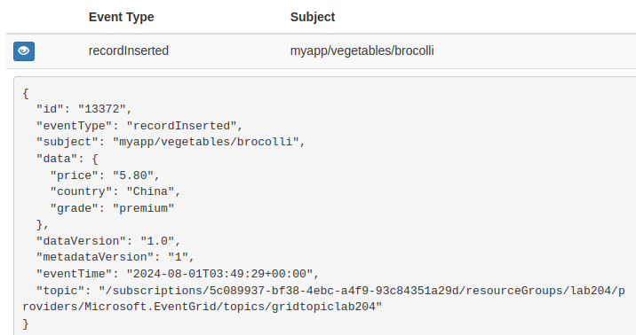
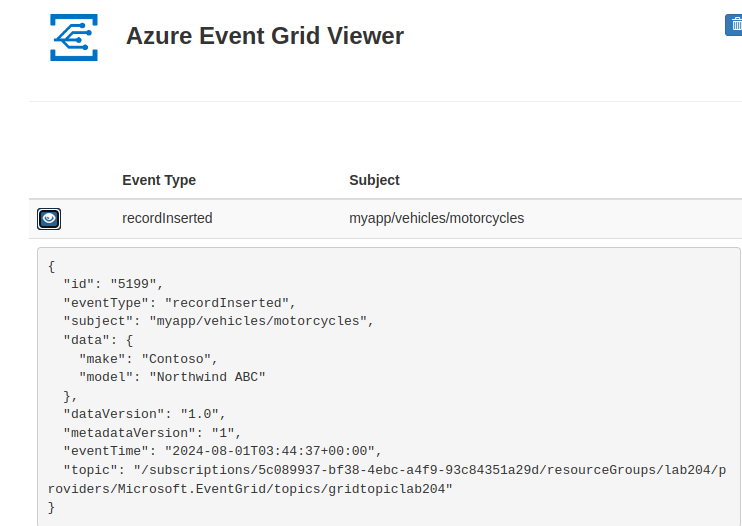

# Step of Event Grid lab

```
# Create some variables in var.sh
(.venv) $ source var.sh
(.venv) $ echo $myLocation 
eastus

# Register the Event Grid resource provider by using the az 
provider register command.
az provider register --namespace Microsoft.EventGrid

# To check the status run the following command.
az provider show --namespace Microsoft.EventGrid --query "registrationState"

# Create a custom topic
az eventgrid topic create --name $myTopicName --location $myLocation --resource-group lab204

{
  "dataResidencyBoundary": "WithinGeopair",
  "disableLocalAuth": false,
  "endpoint": "https://gridtopiclab204.eastus-1.eventgrid.azure.net/api/events",
  "extendedLocation": null,
  "id": "/subscriptions/<SUBSCRIPTION_ID>/resourceGroups/lab204/providers/Microsoft.EventGrid/topics/gridtopiclab204",
  "identity": {
    "principalId": null,
    "tenantId": null,
    "type": "None",
    "userAssignedIdentities": null
  },
  "inboundIpRules": null,
  "inputSchema": "EventGridSchema",
  "inputSchemaMapping": null,
  "kind": "Azure",
  "location": "eastus",
  "metricResourceId": "749460b4-52df-43f6-a512-7eee6ceb5a94",
  "name": "gridtopiclab204",
  "privateEndpointConnections": null,
  "provisioningState": "Succeeded",
  "publicNetworkAccess": "Enabled",
  "resourceGroup": "lab204",
  "sku": {
    "name": "Basic"
  },
  "systemData": null,
  "tags": null,
  "type": "Microsoft.EventGrid/topics"
}

# Create a message endpoint
# Before subscribing to the custom topic, we need to create the endpoint for the event message. 
# Typically, the endpoint takes actions based on the event data. The following script uses a prebuilt 
# web app that displays the event messages. The deployed solution includes an App Service plan, an App # Service web app, and source code from GitHub. It also generates a unique name for the site.

(.venv) $ az deployment group create \
> --resource-group lab204 \
> --template-uri "https://raw.githubusercontent.com/Azure-Samples/azure-event-grid-viewer/main/azuredeploy.json" \
> --parameters siteName=$mySiteName hostingPlanName=viewerhost

{
  "id": "/subscriptions/SUBSCRIPTION_ID/resourceGroups/lab204/providers/Microsoft.Resources/deployments/azuredeploy",
  "location": null,
  "name": "azuredeploy",
  "properties": {
    "correlationId": "910f240d-6aeb-45c3-a003-91727d1b6c41",
    "debugSetting": null,
    "dependencies": [
      {
        "dependsOn": [
          {
            "id": "/subscriptions/SUBSCRIPTION_ID/resourceGroups/lab204/providers/Microsoft.Web/serverfarms/viewerhost",
            "resourceGroup": "lab204",
            "resourceName": "viewerhost",
            "resourceType": "Microsoft.Web/serverfarms"
          }
        ],
        "id": "/subscriptions/SUBSCRIPTION_ID/resourceGroups/lab204/providers/Microsoft.Web/sites/gridsitelab204",
        "resourceGroup": "lab204",
        "resourceName": "gridsitelab204",
        "resourceType": "Microsoft.Web/sites"
      },
      {
        "dependsOn": [
          {
            "id": "/subscriptions/SUBSCRIPTION_ID/resourceGroups/lab204/providers/Microsoft.Web/Sites/gridsitelab204",
            "resourceGroup": "lab204",
            "resourceName": "gridsitelab204",
            "resourceType": "Microsoft.Web/Sites"
          }
        ],
        "id": "/subscriptions/SUBSCRIPTION_ID/resourceGroups/lab204/providers/Microsoft.Web/sites/gridsitelab204/sourcecontrols/web",
        "resourceGroup": "lab204",
        "resourceName": "gridsitelab204/web",
        "resourceType": "Microsoft.Web/sites/sourcecontrols"
      }
    ],
    "duration": "PT1M40.3429784S",
    "error": null,
    "mode": "Incremental",
    "onErrorDeployment": null,
    "outputResources": [
      {
        "id": "/subscriptions/SUBSCRIPTION_ID/resourceGroups/lab204/providers/Microsoft.Web/serverfarms/viewerhost",
        "resourceGroup": "lab204"
      },
      {
        "id": "/subscriptions/SUBSCRIPTION_ID/resourceGroups/lab204/providers/Microsoft.Web/sites/gridsitelab204",
        "resourceGroup": "lab204"
      },
      {
        "id": "/subscriptions/SUBSCRIPTION_ID/resourceGroups/lab204/providers/Microsoft.Web/sites/gridsitelab204/sourcecontrols/web",
        "resourceGroup": "lab204"
      }
    ],
    "outputs": {
      "appServiceEndpoint": {
        "type": "String",
        "value": "https://gridsitelab204.azurewebsites.net"
      }
    },
    "parameters": {
      "branch": {
        "type": "String",
        "value": "main"
      },
      "hostingPlanName": {
        "type": "String",
        "value": "viewerhost"
      },
      "location": {
        "type": "String",
        "value": "eastus"
      },
      "repoURL": {
        "type": "String",
        "value": "https://github.com/Azure-Samples/azure-event-grid-viewer.git"
      },
      "siteName": {
        "type": "String",
        "value": "gridsitelab204"
      },
      "sku": {
        "type": "String",
        "value": "F1"
      }
    },
    "parametersLink": null,
    "providers": [
      {
        "id": null,
        "namespace": "Microsoft.Web",
        "providerAuthorizationConsentState": null,
        "registrationPolicy": null,
        "registrationState": null,
        "resourceTypes": [
          {
            "aliases": null,
            "apiProfiles": null,
            "apiVersions": null,
            "capabilities": null,
            "defaultApiVersion": null,
            "locationMappings": null,
            "locations": [
              "eastus"
            ],
            "properties": null,
            "resourceType": "serverfarms",
            "zoneMappings": null
          },
          {
            "aliases": null,
            "apiProfiles": null,
            "apiVersions": null,
            "capabilities": null,
            "defaultApiVersion": null,
            "locationMappings": null,
            "locations": [
              "eastus"
            ],
            "properties": null,
            "resourceType": "sites",
            "zoneMappings": null
          },
          {
            "aliases": null,
            "apiProfiles": null,
            "apiVersions": null,
            "capabilities": null,
            "defaultApiVersion": null,
            "locationMappings": null,
            "locations": [
              null
            ],
            "properties": null,
            "resourceType": "sites/sourcecontrols",
            "zoneMappings": null
          }
        ]
      }
    ],
    "provisioningState": "Succeeded",
    "templateHash": "11110332134033812068",
    "templateLink": {
      "contentVersion": "1.0.0.0",
      "id": null,
      "queryString": null,
      "relativePath": null,
      "uri": "https://raw.githubusercontent.com/Azure-Samples/azure-event-grid-viewer/main/azuredeploy.json"
    },
    "timestamp": "2024-08-01T03:07:16.096788+00:00",
    "validatedResources": null
  },
  "resourceGroup": "lab204",
  "tags": null,
  "type": "Microsoft.Resources/deployments"
}

# Subscribe to a custom topic
# You subscribe to an Event Grid topic to tell Event Grid which events you want to track and 
# where to send those events.
(.venv) $ az eventgrid event-subscription create \
> --source-resource-id "/subscriptions/SUBSCRIPTION_ID/resourceGroups/lab204/providers/Microsoft.EventGrid/topics/$myTopicName" \
> --name my1lab204ViewSub \
> --endpoint $mySiteURL/api/updates
If you are creating an event subscription from a topic that has “Azure” as the value for its “kind” property, you must validate your webhook endpoint by following the steps described in https://aka.ms/eg-webhook-endpoint-validation.
{
  "deadLetterDestination": null,
  "deadLetterWithResourceIdentity": null,
  "deliveryWithResourceIdentity": null,
  "destination": {
    "azureActiveDirectoryApplicationIdOrUri": null,
    "azureActiveDirectoryTenantId": null,
    "deliveryAttributeMappings": null,
    "endpointBaseUrl": "https://gridsitelab204.azurewebsites.net/api/updates",
    "endpointType": "WebHook",
    "endpointUrl": null,
    "maxEventsPerBatch": 1,
    "preferredBatchSizeInKilobytes": 64
  },
  "eventDeliverySchema": "EventGridSchema",
  "expirationTimeUtc": null,
  "filter": {
    "advancedFilters": null,
    "enableAdvancedFilteringOnArrays": null,
    "includedEventTypes": null,
    "isSubjectCaseSensitive": null,
    "subjectBeginsWith": "",
    "subjectEndsWith": ""
  },
  "id": "/subscriptions/SUBSCRIPTION_ID/resourceGroups/lab204/providers/Microsoft.EventGrid/topics/gridtopiclab204/providers/Microsoft.EventGrid/eventSubscriptions/my1lab204ViewSub",
  "labels": null,
  "name": "my1lab204ViewSub",
  "provisioningState": "Succeeded",
  "resourceGroup": "lab204",
  "retryPolicy": {
    "eventTimeToLiveInMinutes": 1440,
    "maxDeliveryAttempts": 30
  },
  "systemData": null,
  "topic": "/subscriptions/SUBSCRIPTION_ID/resourceGroups/lab204/providers/microsoft.eventgrid/topics/gridtopiclab204",
  "type": "Microsoft.EventGrid/eventSubscriptions"
}
(.venv) $ 

# Send an event to your custom topic
# Trigger an event to see how Event Grid distributes the message to your endpoint.

# Trigger an event to see how Event Grid distributes the message to your endpoint.

# Retrieve URL and key for the custom topic.

topicEndpoint=$(az eventgrid topic show --name $myTopicName -g lab204 --query "endpoint" --output tsv)
key=$(az eventgrid topic key list --name $myTopicName -g lab204 --query "key1" --output tsv)

(.venv) $ echo $topicEndpoint 
https://gridtopiclab204.eastus-1.eventgrid.azure.net/api/events

# Create event data to send. Typically, an application or Azure service 
# would send the event data, we're creating data for the purposes of the exercise.
event='[ {"id": "'"$RANDOM"'", "eventType": "recordInserted", "subject": "myapp/vehicles/motorcycles", "eventTime": "'`date +%Y-%m-%dT%H:%M:%S%z`'", "data":{ "make": "Contoso", "model": "Northwind"},"dataVersion": "1.0"} ]'

# Use curl to send the event to the topic.

curl -X POST -H "aeg-sas-key: $key" -d "$event" $topicEndpoint

# Delete resources

az group delete --name lab204 --no-wait

```

# Output from the Event Grid Viewer



